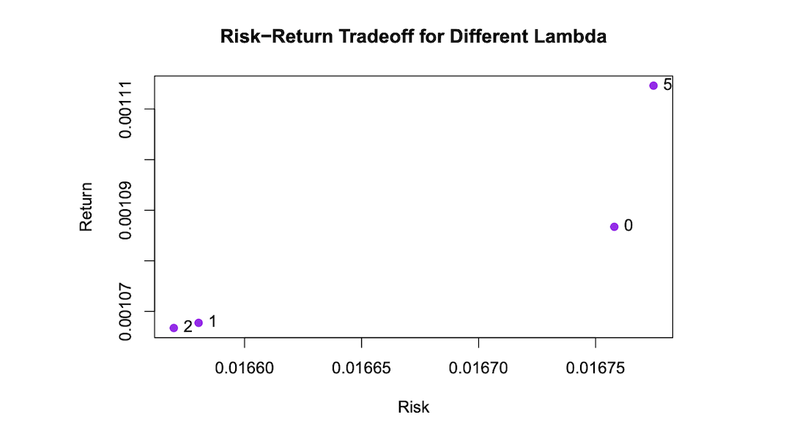
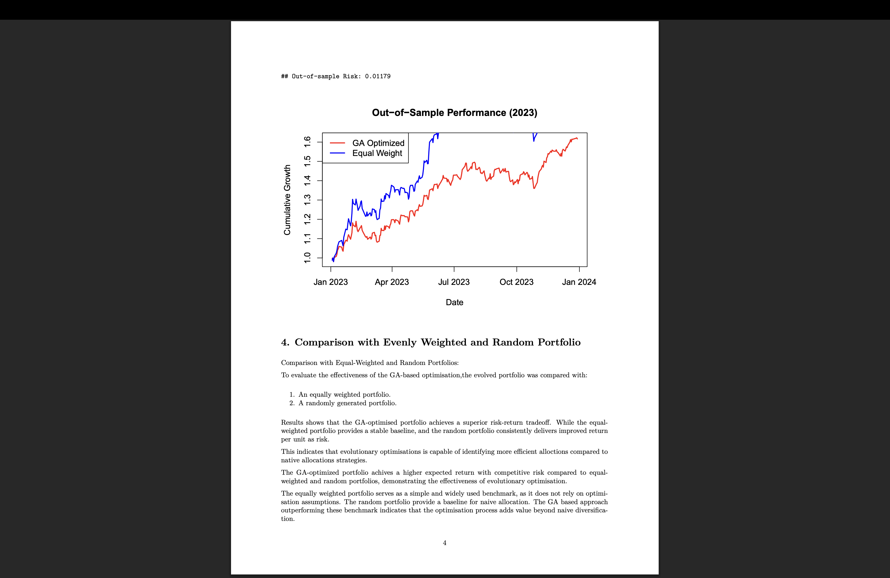
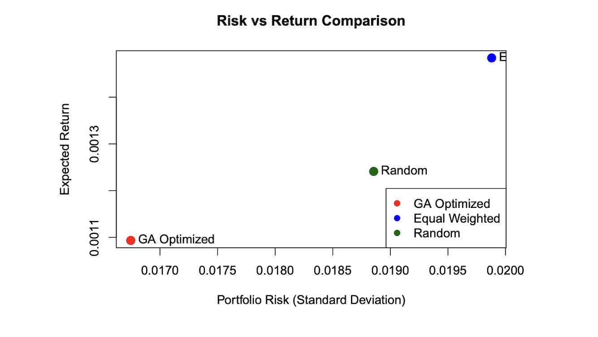

# portfolio-optimization-ga
Portfolio Optimization using Genetic Algorithms (GA) to maximize return and minimize risk. Developed as part of MSc coursework in AI for Finance.

# 📊 Portfolio Optimization using Genetic Algorithms (GA)

This project focuses on optimizing a portfolio of financial assets using **Genetic Algorithms (GA)** to achieve an optimal balance between **risk and return**.

---

## 🚀 Project Overview

Traditional portfolio optimization methods (like Markowitz) rely on convex optimization techniques.  
In this project, I implemented a **Genetic Algorithm-based approach** to:

- Maximize expected returns 📈  
- Minimize portfolio risk 📉  
- Explore multiple risk-return trade-offs  

---

## 🧠 Key Features

- Genetic Algorithm for portfolio weight optimization 
- Risk-return trade-off using lambda parameter  
- Train/Test split for real-world evaluation  
- Comparison with:
  - Equal-weight portfolio  
  - Random portfolio  
- Asset selection using GA  

---

## 📊 Results & Insights

- GA successfully identified optimal portfolio weights  
- Achieved better risk-return balance compared to benchmarks  
- Demonstrated strong generalization on unseen data  
- Flexible optimization for different risk preferences  

---

## 📊 Key Visualizations

The project includes:

### 🔄 GA Convergence
- Generation vs Fitness
- Algorithm learning process
- Optimization stable

### ⚖️ Risk-Return Tradeoff (Lambda)
- Advanced concept:
- Risk vs Return tradeoff tuning

### 📉 Out-of-Sample Performance
- Real-world Performance
- Generalization

### 📈 Risk vs Return Comparison
- Direct Comparison
- GA vs Equal vs Random

---

## 🛠️ Tech Stack

- R  
- Genetic Algorithm (GA package)  
- Financial data analysis  
- Data visualization  

---

## 📂 Project Structure

portfolio-optimization-ga/
│
├── notebooks/
│   └── portfolio_optimization.Rmd
│
├── results/
│   └── portfolio_optimization_report.pdf
│
├── README.md
└── LICENSE

---

---

## 📌 Key Learnings

- Evolutionary algorithms for optimization problems  
- Portfolio theory and risk-return trade-off  
- Model evaluation on unseen data  
- Practical implementation of financial ML concepts  

---

## 🔗 Full Report

👉 Check detailed report here:  
`results/portfolio_optimization_report.pdf`

---

## 👨‍💻 Author

Sudeep Chakravarty  
MSc Advanced Computer Science with Data Science
