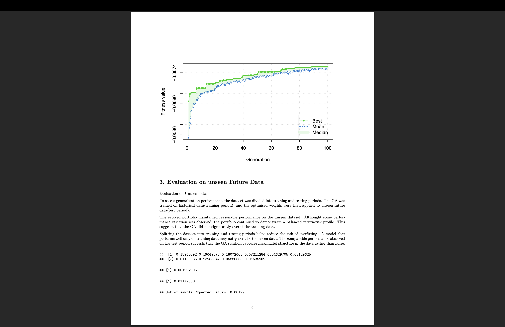
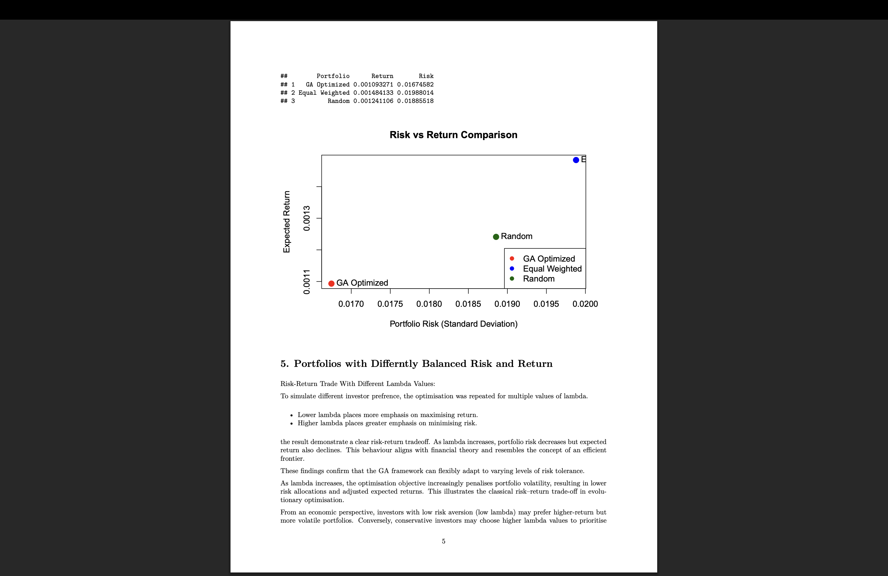

# portfolio-optimization-ga
Portfolio Optimization using Genetic Algorithms (GA) to maximize return and minimize risk. Developed as part of MSc coursework in AI for Finance.

# 📊 Portfolio Optimization using Genetic Algorithms (GA)

🚀 Built using Genetic Algorithms to optimize financial portfolios by balancing risk and return.

This project focuses on optimizing a portfolio of financial assets using **Genetic Algorithms (GA)** to achieve an optimal balance between **risk and return**.

---

## 🚀 Project Overview

Traditional portfolio optimization methods (like Markowitz) rely on convex optimization techniques.  
In this project, I implemented a **Genetic Algorithm-based approach** to:

- Maximize expected returns 📈  
- Minimize portfolio risk 📉  
- Explore multiple risk-return trade-offs  

---

## 🧠 Key Features

- Genetic Algorithm for portfolio weight optimization 
- Risk-return trade-off using lambda parameter  
- Train/Test split for real-world evaluation  
- Comparison with:
  - Equal-weight portfolio  
  - Random portfolio  
- Asset selection using GA  

---

## 📊 Results & Insights

- GA successfully identified optimal portfolio weights  
- Achieved improved risk-return balance compared to equal-weight and random portfolios
- Reduced portfolio risk while maintaining competitive returns
- Demonstrated stable convergence of the optimization algorithm
- Flexible optimization for different risk preferences  

---

## 📊 Key Visualizations

The project includes:

### 🔄 GA Convergence
- Generation vs Fitness
- Algorithm learning process
- Optimization stable

  

### ⚖️ Risk-Return Tradeoff (Lambda)
- Advanced concept:
- Risk vs Return tradeoff tuning
- This plot shows how portfolio risk and return change with different lambda values.

  

### 📉 Out-of-Sample Performance
- Real-world Performance
- Generalization

  

### 📈 Risk vs Return Comparison
- Direct Comparison
- GA vs Equal vs Random

  

---

## 🛠️ Tech Stack

- R  
- Genetic Algorithm (GA package)  
- Financial data analysis  
- Data visualization  

---

## 📂 Project Structure

portfolio-optimization-ga/
│── notebooks/
│   └── portfolio_optimization.Rmd
│── images/
│── results/
│   └── portfolio_optimization_report.pdf
│── data/
│── README.md
│── LICENSE

---

## 📌 Key Learnings

- Evolutionary algorithms for optimization problems  
- Portfolio theory and risk-return trade-off  
- Model evaluation on unseen data  
- Practical implementation of financial ML concepts  

---

## 🔗 Full Report

👉 Check detailed report here:  
`results/portfolio_optimization_report.pdf`

---

## ▶️ How to Run

1. Clone the repository
2. Open `portfolio_optimization.Rmd`
3. Run in RStudio
4. Generate results and visualizations

---

## 🔮 Future Improvements

- Incorporate real-time financial data
- Apply deep learning for asset prediction
- Improve portfolio diversification techniques

---

## 👨‍💻 Author

**Sudeep Chakravarty**  
MSc Advanced Computer Science with Data Science  
📊 AI for Finance | 📈 Portfolio Optimization | 🤖 Machine Learning 

---

## 📬 Connect with Me

If you found this project interesting, feel free to connect on LinkedIn!
www.linkedin.com/in/sudeep-chakravarty-51142422b
